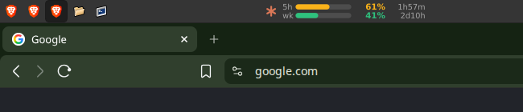
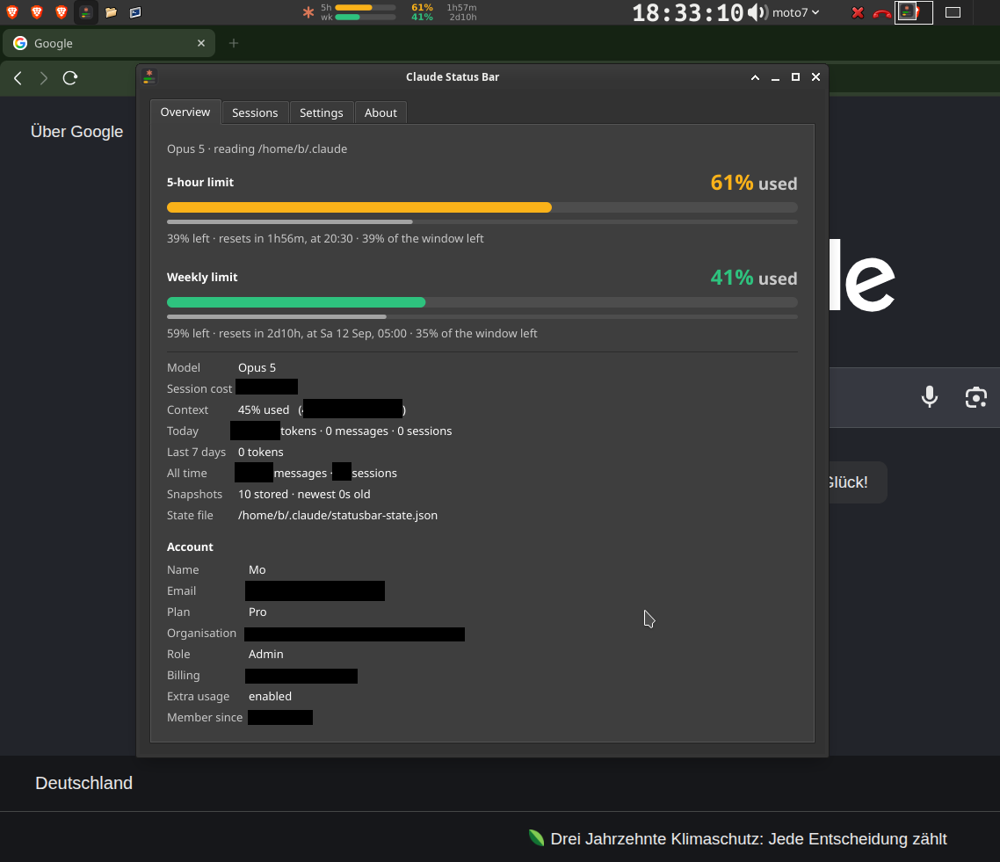
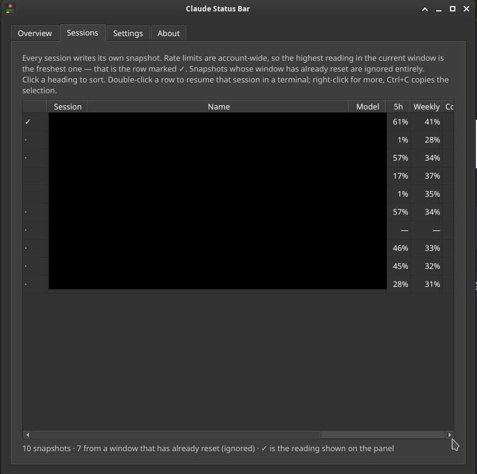
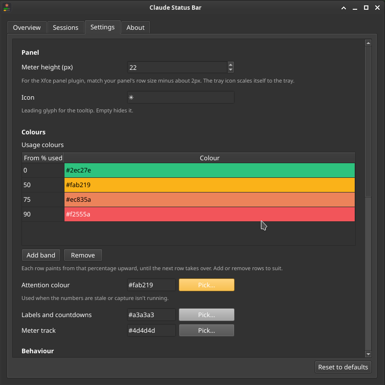
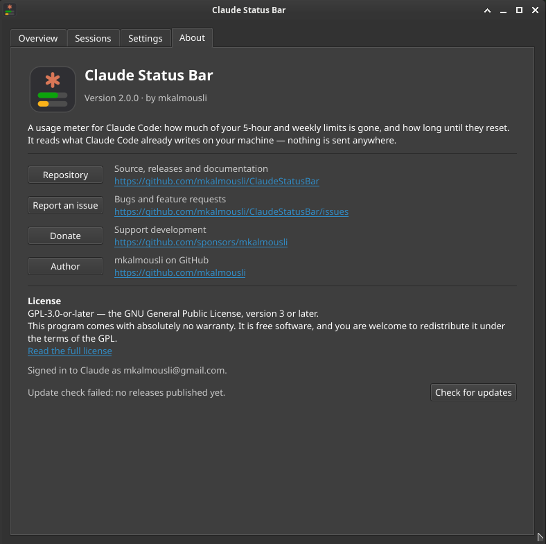

# Claude Status Bar

**A usage meter for Claude Code that lives in your panel or tray.** How much of
your 5-hour and weekly limits is gone, and how long until they reset — at a
glance, without opening anything.

<br clear="left">

<p align="center">
  
  <br>
  <sub>The panel item: two meters, the percentage used, and the countdown to each reset.</sub>
</p>

Runs on **Linux** (Xfce, KDE, GNOME, Cinnamon, MATE…), **Windows** and
**macOS**. It reads only what Claude Code already writes on your machine.

- **Both rate limits at once** — the 5-hour and the weekly, each with its own
  meter, percentage and countdown
- **Colour by how much is gone** — configurable bands, green → amber → orange →
  red by default; the number sits beside the meter, so colour is never the only
  thing carrying the reading
- **Updates the moment a session writes** — a file watch, not a poll
- **A details window** — live meters, a per-session drill-down, and every setting
- **Honest about staleness** — it says when the numbers are old, and why
- **Optional update check** — once a day, and the only time it touches the network

## The window

Click the panel item, or run `claude-statusbar --gui`.

<table>
<tr>
<td width="50%" valign="top">
  
  <br><sub><b>Overview</b> — both limits with a slim second bar for how much of
  the window is left, the exact reset time, plus session cost, context, token
  history and the signed-in account.</sub>
</td>
<td width="50%" valign="top">
  
  <br><sub><b>Sessions</b> — every stored snapshot, sortable, with ✓ on the one
  the meter is actually reading. Double-click a row to resume that session in a
  terminal; Ctrl+C copies the selection.</sub>
</td>
</tr>
<tr>
<td width="50%" valign="top">
  
  <br><sub><b>Settings</b> — applied as you change them, no Save button. The
  colour bands are a table you can add rows to and remove them from.</sub>
</td>
<td width="50%" valign="top">
  
  <br><sub><b>About</b> — repository, issues, donation and author links, the
  licence, and the update check.</sub>
</td>
</tr>
</table>

## Where it appears

| System | What you get |
|---|---|
| **Xfce** | a real `xfce4-panel` plugin (compiled C) — *Add New Items… → Claude Status Bar* |
| **KDE, Cinnamon, MATE, Budgie** | a StatusNotifier tray icon |
| **GNOME** | a tray icon (needs the AppIndicator extension) |
| **Windows** | a notification-area icon |
| **macOS** | a menu-bar item |

The Xfce plugin is a compiled GTK module, because the panel loads plugins as
shared libraries; everything else is Qt. Both draw the *same* SVG, so the panel
item and the tray icon are the same picture.

## Install

```sh
git clone https://github.com/mkalmousli/ClaudeStatusBar.git
cd ClaudeStatusBar
make install          # Linux
```

Windows and macOS (or Linux without `make`):

```sh
uv sync
uv run claude-statusbar --install
```

The installer wires up capture and then sets up whichever integration fits the
machine: on Xfce it registers the panel plugin, elsewhere it adds a login entry
for the tray icon. `--uninstall` reverses all of it.

### Requirements

- **Python 3.9+** and [**uv**](https://docs.astral.sh/uv/)
- PySide6 and platformdirs — `uv` installs both
- Xfce plugin only: `gcc`, `pkg-config`, `libgtk-3-dev`, `libxfce4panel-2.0-dev`
  and `librsvg2-common`

> The venv is built on the **system** interpreter with `--system-site-packages`,
> because the Xfce plugin needs the system PyGObject and an isolated venv can't
> see it. The Makefile handles that; it only matters if you build it yourself.

### The Xfce panel plugin

```sh
make deps           # the build dependencies listed above
make xfce-plugin    # compile, install (needs root once), reload the panel
```

Then add it: right-click the panel → **Panel → Add New Items… → Claude Status
Bar**.

xfce4-panel 4.x `dlopen`s each plugin and calls `xfce_panel_module_construct()`
in it — the `X-XFCE-Exec` protocol that let a plugin be any executable was
removed after Xfce 4.4. A panel item therefore has to be **compiled C**, which
is what `native/xfce/claude-statusbar-plugin.c` is: a thin module that asks
`claude-statusbar --panel` for an SVG and a tooltip, asynchronously so the panel
never blocks, watches the state file so it redraws the moment a session writes,
and opens the window on click. Installing it writes two root-owned files, the
module and its `.desktop`; nothing else needs root.

Not interested in compiling? The tray icon works on Xfce too, in the
notification area: `claude-statusbar --install-autostart`.

## Commands

```
claude-statusbar                    start the tray icon (default)
claude-statusbar --gui              just the details and settings window

claude-statusbar --install          wire up capture + this desktop
claude-statusbar --uninstall        undo all of it
claude-statusbar --install-xfce-plugin / --remove-xfce-plugin
claude-statusbar --install-autostart / --remove-autostart

claude-statusbar --statusline       Claude Code's status line (stores + prints)
claude-statusbar --capture          store only, echo stdin (for chaining)
```

## Settings

Everything is in the window's **Settings** tab and applies as you change it.
Settings are saved to a JSON file in the platform's config directory, and only
values you actually change are written — the rest keep following the defaults
across upgrades.

Durations are written the way you'd say them: `20s`, `5m`, `1h30m`, even
`20m20s100ms`. The defaults live in one place,
[`src/claude_statusbar/config.py`](src/claude_statusbar/config.py), and that
same declaration builds the settings form, so the file is the complete list of
what exists.

## How it gets the numbers

Rate limits only exist **inside a running Claude Code session**, so capture has
to run there. Two routes, picked automatically:

- if Claude Code already runs a POSIX `statusline.sh`, a line is spliced into it
  so you keep the status line you had;
- otherwise — no script, or Windows, where there is none — it becomes Claude's
  own `statusLine` command and prints a compact line (any previous command is
  saved and restored on uninstall).

Either way the reading lands in `~/.claude/statusbar-state.json`, which the
panel and tray read. Token and message history comes from
`~/.claude/stats-cache.json`, topped up from today's session logs when that
cache lags — it refreshes lazily and can be days behind.

Nothing about your usage leaves the machine. The one network request the program
makes is the update check, which asks GitHub for the latest release tag once a
day and can be switched off in Settings.

### Several sessions at once

Every session writes its own snapshot, and they re-render at different moments,
so the newest *write* is not the newest *reading*: a session that hasn't
refreshed reports an older, lower number. Because usage only climbs within a
window, the highest reading in the current window is the freshest one, and
that's what's shown. Which window a snapshot belongs to is decided by its reset
time — anything past its reset is discarded, since that usage was wiped at the
rollover, and of what remains only snapshots sharing the latest reset time are
compared. **The Sessions tab shows this happening**, marking with ✓ the snapshot
the meter is reading and counting how many were ignored.

### Staleness

Claude Code re-runs the status line on conversation activity, not on a timer, so
the state can be minutes old while a session is perfectly alive — during one
long turn, for instance. Liveness is therefore read from the mtime of the newest
log in `~/.claude/projects`, never from the state file's age. The views caption
the numbers `updated 16m ago` while a session is running, and only warn `no
session open` when nothing is there. Reset countdowns come from absolute
timestamps, so they stay exact regardless.

If a session *is* running and the numbers still aren't refreshing, capture isn't
firing — usually because something rewrote `statusline.sh`. The views say so
directly rather than quietly showing a frozen snapshot, which is the one failure
mode that looks completely normal.

## Layout

```
src/claude_statusbar/
├── cli.py           command dispatch
├── config.py        settings declaration, defaults, load/save
├── paths.py         per-OS locations
├── util.py          formatting and parsing helpers
├── locking.py       cross-platform file lock (flock / msvcrt)
├── capture.py       reads Claude's statusline JSON, writes the state file
├── data.py          turns snapshots into the displayed numbers
├── render.py        colour bands and the two meter rows
├── meter.py         the SVG drawing, shared by every surface
├── hook.py          wires capture into Claude Code
├── install.py       desktop integration (Xfce plugin, autostart)
├── single.py        keeps the app to one instance
├── update.py        the once-a-day release check
├── launcher.py      opens a session in a terminal / a folder in the file manager
├── tray.py          Qt tray icon — all desktops and OSes
└── window.py        Qt details, sessions, settings and about

native/xfce/
├── claude-statusbar-plugin.c   the xfce4-panel module
└── claude-statusbar.desktop    what makes it appear in Add New Items

logo.svg             the application icon (copied into the package on install)
```

## License

[GPL-3.0-or-later](LICENSE). This program comes with absolutely no warranty; it
is free software, and you are welcome to redistribute it under the terms of the
GNU General Public License, version 3 or later.
